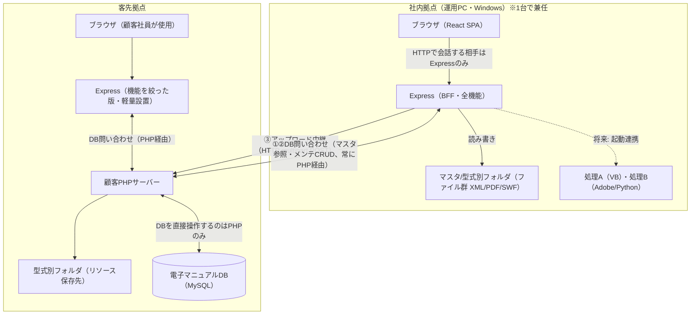

# システム構成図（アプリ全体）

（作成: 2026-07-13。既存の`docs/システム全体図.md`・`docs/デプロイ構成.md`の内容を、正式な「システム構成図」として整理・統合したもの。詳細な経緯・検討過程は両ドキュメントを参照）

## 位置づけ

このアプリは**社内（運用PC）と客先の2拠点**にデプロイされる。同一のReact/Expressコードベースを、権限（ロール、※未実装）で機能を出し分けて両拠点に配置する構成。

## 構成図

**原則**: DBに直接接続できるのは**顧客PHPサーバーのみ**。Express（社内・客先どちらも）はDBと直接通信せず、必ず顧客PHPのAPIを介する。

## ハードウェア・ソフトウェア構成一覧

| 拠点 | 項目 | 内容 |
|---|---|---|
| 社内 | ハードウェア | Windows機 1台（新規） |
| 社内 | OS制約 | Windows必須（処理A=VB、処理B=Adobe/Pythonに依存） |
| 社内 | ソフトウェア | ブラウザ、Express（Node.js）、処理A/B、better-sqlite3（デモ時のみ） |
| 社内 | 利用者 | 社内スタッフ |
| 客先 | ハードウェア | 既存の顧客サーバー環境を流用（新規ハード不要な見込み） |
| 客先 | OS制約 | 特になし（Linux可・軽量） |
| 客先 | ソフトウェア | ブラウザ、Express（機能を絞った軽量版）、既存のPHPサーバー、MySQL（電子マニュアルDB） |
| 客先 | 利用者 | 顧客の社員（社外ユーザー） |

## 拠点間通信

| # | 経路 | 内容 | 方向 |
|---|---|---|---|
| ① | Express（社内）→ 顧客PHPサーバー | マスタ参照（車種／型式一覧、PHP経由でMainDBを参照） | 読むだけ |
| ② | Express（社内 or 客先）⇔ 顧客PHPサーバー | メンテナンス（アカウント認証等のCRUD、PHP経由でMainDBを読み書き） | 読み書き |
| ③ | Express（社内）→ 顧客PHPサーバー | ファイルアップロード中継（multipart POST） | 送るだけ |
| ④ | 処理A → 処理B（社内ローカル） | XML分割 → PDF/SWF変換 | 変換（現状手動、将来Expressが起動） |

> ①②とも、MainDBへの直接接続はしない。顧客PHPサーバーがDB操作を仲介する（ExpressはPHPのAPIを叩くだけ）。

## 未確認事項（この構成図の前提に影響するもの）

- 顧客サーバーにNode（Express）を設置できるか（顧客の運用ポリシー次第）
- 客先Expressのネットワーク到達範囲（顧客LAN内に閉じるか、外部公開するか）
- 社内→顧客サーバーへのアップロード経路（VPN／専用線／インターネット）

詳細な検討過程・見積もり観点は [デプロイ構成](../デプロイ構成.md)、データの流れの詳細は [システム全体図](../システム全体図.md) を参照。
