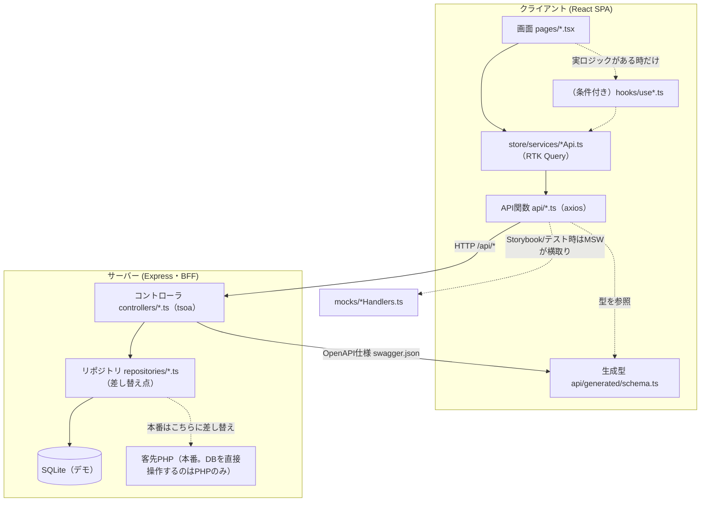

# アプリケーション方式設計書（アプリ全体）

（作成: 2026-07-13。既存の`docs/画面実装パターン.md`・`docs/バリデーションとエラー処理.md`・`docs/技術スタック.md`を統合し、正式な方式設計書として整理したもの）

## 1. レイヤ構成

1つの機能を役割ごとの層に分け、**各層は隣の層としか話さない**方針を採る。

| 層 | 役割 | 知らないこと |
|----|---|---|
| 画面 (`pages/*.tsx`) | 見た目・操作。`store/services/*Api.ts`が生成したRTK Queryフックを直接呼ぶ | fetch・URL・DB |
| （フック `hooks/use*.ts`、条件付き） | `skip`条件・デフォルト引数など**実ロジックがある時だけ**作る中間層。名前の付け替えだけの再エクスポート層は作らない（2026-07-14方針） | 画面の見た目・DB |
| RTK Query (`store/services/*Api.ts`) | データ取得・キャッシュ・再取得・invalidate | 画面の見た目・DB |
| API関数 (`api/*.ts`) | HTTP通信（axios）。型はOpenAPI生成スキーマ由来 | 画面・DBの中身 |
| ── HTTPの境界 ── | | |
| コントローラ (`server/src/controllers/*.ts`、tsoa) | URL受付・型からの入力自動検証・OpenAPI仕様生成 | DBの読み方 |
| リポジトリ (`server/src/repositories/*.ts`) | データの読み書き。デモ=SQLiteへ直接、本番=**客先PHPのAPI呼び出し**（客先DBへ直接接続はしない）。**本番化の差し替え点** | HTTP・画面 |
| DB | データ保管（デモ=SQLite。本番は客先MySQLで、**直接操作できるのは客先PHPのみ**） | 上の全部 |

## 2. Webアプリケーション全体構造

- **クライアントはExpressとだけ通信**し、PHP・処理A/B・客先DBを直接意識しない（CLAUDE.mdの中核方針）
- **型の単一の真実はサーバーのtsoaコントローラ**。`yarn gen:api`でコントローラ→OpenAPI仕様（`server/src/generated/swagger.json`）→クライアント型（`client/src/api/generated/schema.ts`）を再生成する。client/serverで型を二重に書かない
- **本番化の差し替え点は`repositories/`のみ**。画面・フック・API関数・コントローラは無変更のまま、SQLiteアクセスを客先PHPのAPI呼び出しに置き換える。**客先DBへの直接接続は行わない**（DBを直接操作できるのは客先PHPのみ）
- **テスト/Storybookは実サーバー不要**。`mocks/*Handlers.ts`（MSW）がfetch/axiosを横取りする。本番と同じURLを叩くため、モック用の分岐がアプリコードに混ざらない
- 1機能あたりのファイル構成は8つに定型化されている（画面／フォーム／フック／API関数／モック／コントローラ／リポジトリ／DB定義）。新規画面はこの型をコピー＋改名して作る（詳細は`docs/画面実装パターン.md`のチェックリスト）

## 3. 例外処理方式

**原則**: クライアント検証＝UX（即時フィードバック）。サーバー検証＝本当の門番。両方行うが役割が違う（補完関係であり重複ではない）。

| 種類 | 担当 | 例 |
|---|---|---|
| その場で分かるもの | クライアント（即時） | 必須項目の未入力・形式不正 |
| サーバーにしか分からないもの | サーバー（送信後） | ユーザー名重複・業務ルール・データ整合性 |

**ステータスコードの使い分け**:

| コード | 意味 | 発生元 |
|---|---|---|
| 422 | tsoaの型検証エラー（`details`にフィールド別メッセージ） | コントローラ |
| 409 | UNIQUE制約違反（例: username重複） | リポジトリ→コントローラ |
| 404 | 対象が見つからない | コントローラ |
| 500 | 未分類のサーバーエラー | Expressのエラーハンドラ（`server/src/index.ts`） |
| 413 | アップロードデータが大きすぎる | multer（Excel取り込み等） |

**エラーの表示先統一ルール**: クライアント由来・サーバー由来を問わず、**同じ項目には同じ場所**にエラーを出す（例: username必須も、username重複も、同じusername欄の下に赤字）。項目に紐付かないエラーはダイアログ上部のAlertまたはトーストに出す。

クライアント側は`client/src/api/error.ts`の`ApiError`／`toFieldErrors`／`toApiError`（axios用）が変換を担う。サーバー側は`server/src/index.ts`のエラーハンドラが`ValidateError`を422に整形し、それ以外は`console.error`でログを残した上で実際のステータスコードを返す（2026-07-10、無言で500を返す不具合を修正済み）。

詳細は`docs/バリデーションとエラー処理.md`を参照。

## 4. 配備情報

拠点構成・ハードウェアは[システム構成図](06_システム構成図.md)を参照。ここではアプリケーションの配備（ビルド・起動）に絞って記す。

| 項目 | 内容 |
|---|---|
| サーバー起動 | `server`: `npm run build`（tsoa生成→tsc→swagger.jsonコピー）→ `node dist/index.js` |
| クライアントビルド | `client`: Viteでビルド（`dist/`） |
| **クライアント配信方式** | **未確定**。現状Expressに`express.static`等の静的配信設定が無く、本番でReactのビルド成果物をどう配信するか（Express同居配信 or 別Webサーバー）が未決定 |
| 環境変数 | `.env`でSambaパス・顧客PHP URL等を切り替え（`server/src/config.ts`） |
| プロセス常駐化 | 社内運用PCでのExpress常駐化は未着手（例: NSSM等でのWindowsサービス化が候補、`docs/デプロイ構成.md`参照） |

## 5. 未確定・要検討事項

- クライアントビルドの配信方式（Express同居 or 別サーバー）
- Windowsサービス化の具体的な手順・ツール選定
- 客先拠点向けのExpressビルド・設定分離方法（同一コードベースで拠点ごとに機能を絞る、という方針は決定済みだが実装方法は未着手）
