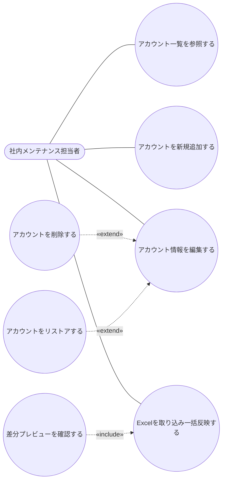

# ユースケース図 — アカウント認証機能

（作成: 2026-07-12。現在の実装 `client/src/pages/AccountAuthTable.tsx` 他、および業務背景メモを基に作成）

## アクターについて（現状の注記）

`docs/画面設計書.md` では「認証・権限管理が中核（客先で顧客社員が一部機能を利用するため）」と**方針としては決定済み**だが、実装を確認したところ `client/src/store/slices/authSlice.ts` はステート定義のみで、ログイン画面・権限による出し分けはどこからも呼ばれておらず**未実装**（`App.tsx`・`Header.tsx`のいずれからも`login`/`isLoggedIn`は参照されていない）。

このため本図のアクターは、現状のコードで実際にこの機能へアクセスできる**唯一の主体**として「社内メンテナンス担当者」のみを記載する。将来、客先社員が使う別ロールが追加された場合はこの図を更新すること。

## 業務背景（アクターとユースケースの根拠）

得意先からのメール連絡（追加／削除（論理）／情報変更／リストア）を受けて、社内メンテナンス担当者がアカウント認証テーブルを更新する（[[project_account_auth_demo]] 参照）。支給されるExcel台帳を都度手作業で1件ずつ反映するのは非効率かつ誤りが起きやすいため、Excel一括取り込み（差分プレビュー→承認→適用）の導線も用意されている。

## ユースケース図

## ユースケース一覧

| ID | ユースケース | 概要 | 対応する実装 |
|---|---|---|---|
| UC-A01 | アカウント一覧を参照する | 登録済みアカウント（削除済み含む全件）を一覧表示し、No./ユーザー名で絞り込む | `AccountAuthTable.tsx` の一覧テーブル・検索欄 |
| UC-A02 | アカウントを新規追加する | 1件ずつ手動でアカウント情報を入力し登録する | `AccountAuthFormDialog.tsx`（新規追加） |
| UC-A03 | アカウント情報を編集する | 既存アカウントの各項目を編集する（削除・リストアの土台となる基本ユースケース） | `AccountAuthFormDialog.tsx`（編集） |
| UC-A04 | アカウントを削除する | UC-A03の拡張。編集フォームの削除フラグ(`delfg`)をONにして保存する論理削除 | 同上フォーム内の削除フラグスイッチ |
| UC-A05 | アカウントをリストアする | UC-A03の拡張。削除済みアカウントの削除フラグをOFFに戻す | 同上フォーム内の削除フラグスイッチ |
| UC-A06 | Excelを取り込み一括反映する | 台帳ファイル（マスタ全件／差分ファイルいずれも可）をアップロードし、複数件の追加・変更・削除・リストアをまとめて反映する | 「Excel取り込み（差分プレビュー）」ボタン〜適用 |
| UC-A07 | 差分プレビューを確認する | UC-A06に含まれる。取り込んだファイルと現在のDBを比較した差分を、承認前にテーブル形式で確認する | `ImportDiffDialog.tsx` |

## 未実装・将来課題（この図の前提に影響する事項）

- 認証・権限による機能の出し分け（`docs/画面設計書.md`で決定済みだが未着手）
- 物理削除（DELETE API）は現状無効化されている（`server/src/controllers/accountAuthController.ts`のコメントアウト部分）。削除は常に論理削除（UC-A04）のみ
