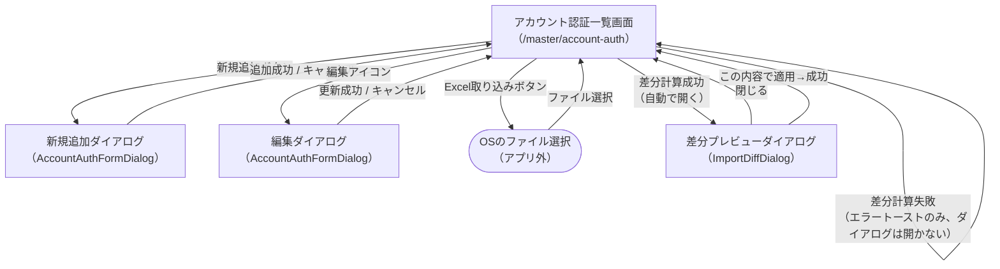

# 画面遷移図 — アカウント認証機能

（作成: 2026-07-12。`client/src/pages/AccountAuthTable.tsx`他の実装を基に作成）

## 前提

本機能はReact Routerの単一ルート（`/master/account-auth`）内で完結しており、画面遷移と呼べるものは**同一ページ内でのダイアログの開閉**のみである（別ルートへの遷移は無い）。ファイル選択はOS標準のファイル選択ダイアログ（ブラウザの`<input type="file">`）を使うため、アプリ側の画面としては扱わない。

## 画面遷移図

## 遷移の補足

| 遷移 | トリガー | 補足 |
|---|---|---|
| 一覧 → 新規追加ダイアログ | 「新規追加」ボタン | `editTarget = null`でダイアログを開く |
| 一覧 → 編集ダイアログ | 各行の「編集」アイコン | `editTarget = 対象行`でダイアログを開く。新規追加と同一コンポーネント（`AccountAuthFormDialog`）を条件分岐で流用 |
| 一覧 → ファイル選択 → 一覧（差分計算） | 「Excel取り込み（差分プレビュー）」ボタン | ファイル選択後、即座にサーバーへアップロードして差分計算。計算結果を待つ間、画面は一覧のまま（ダイアログはまだ開かない） |
| 一覧 → 差分プレビューダイアログ | 差分計算が成功した場合のみ自動遷移 | 失敗時は一覧画面のままエラートーストが出るだけで、ダイアログは開かない |
| 差分プレビューダイアログ → 一覧 | 「閉じる」ボタン、または「この内容で適用」が成功した場合 | 適用が失敗した場合はダイアログを閉じずエラートーストのみ表示（ダイアログに留まる） |

## 画面遷移図の対象外（今回のスコープに含まれないもの）

- ヘッダーの親メニュー（アップロード／ログ閲覧／メンテナンス／データ出力／故障診断／環境設定）間の遷移は、アプリ全体の画面遷移図（未作成）で扱う
- ログイン画面（認証機能は未実装のため対象外。`01_ユースケース図.md`参照）
