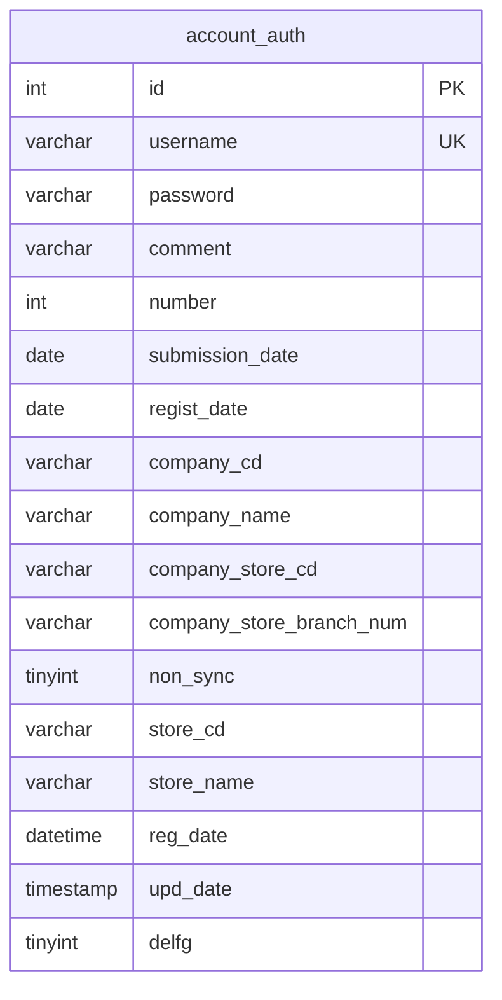
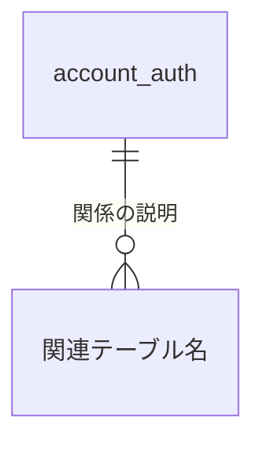

# テーブル関連図 — アカウント認証機能

（作成: 2026-07-13。`server/src/db.ts`の全テーブル定義を確認した上で作成）

## 現状（関連なし・単独テーブル）

`server/src/db.ts`を確認したところ、現在定義されているテーブルは`account_auth`・`vehicle`・`katashiki`の3つのみで、**`account_auth`は他のどのテーブルとも外部キー関係を持たない**単独テーブルである（`vehicle`/`katashiki`は車種・型式マスタで別ドメイン）。

## 注意：見た目は関連がありそうで、実は無いカラム

`company_cd`・`company_store_cd`・`store_cd`は「販社」「販売会社店舗」「販売店」を表すコード値だが、**それらのマスタテーブルはこのDBには存在しない**（外部キー制約も無い自由入力のテキスト）。おそらく客先の別システム（電子マニュアルDB内の他テーブル、または別マスタ）にコード体系の正典があると推測されるが、本プロジェクトのスキーマ上では単なる文字列として扱われている。

## 将来、関連テーブルが増えた場合の記載方針

このテーブルは今後も単独である可能性が高い（アカウント認証専用テーブルのため）。もし関連テーブルが追加された場合は、以下の形式で追記する:

## 未確認事項

- `company_cd`/`company_store_cd`/`store_cd`のコード体系の正典がどこにあるか（客先の別マスタか、単なる自由入力か）
