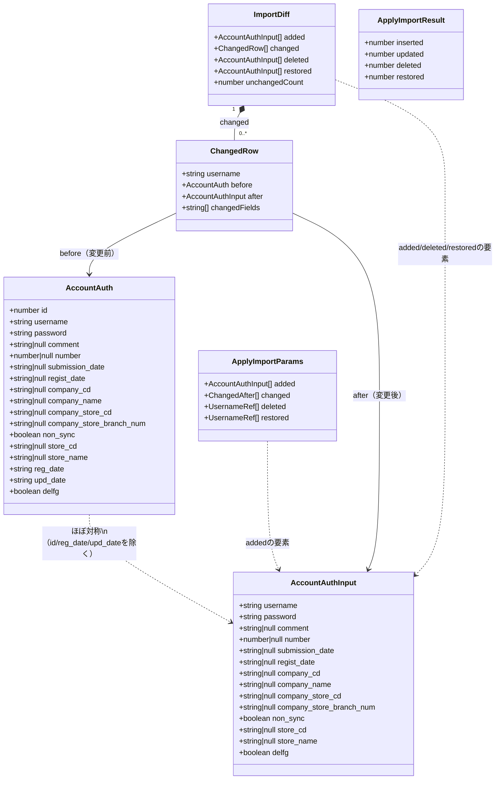

# クラス図（型/インターフェース図）— アカウント認証機能

（作成: 2026-07-13。`server/src/repositories/accountAuth.ts`・`server/src/services/accountAuthDiff.ts`の型定義を基に作成）

## 前提

本プロジェクトはReact+TypeScript/Expressであり、原シリーズが前提とするJavaのDAOクラスのような継承関係を持つクラス設計は行っていない。ここでの「クラス図」は、**主要なデータ型（TypeScriptの`type`/`interface`）とその構造・参照関係**を示すものとして扱う。

## クラス図

## 型の説明

| 型 | 定義場所 | 役割 |
|---|---|---|
| `AccountAuth` | `server/src/repositories/accountAuth.ts` | DBからの読み取り型。全カラムを持つ（`id`・`reg_date`・`upd_date`はサーバー管理） |
| `AccountAuthInput` | 同上 | 書き込み型。`AccountAuth`から`id`/`reg_date`/`upd_date`を除いたもの |
| `ImportDiff` | `server/src/services/accountAuthDiff.ts` | Excel取り込みの差分計算結果。プレビュー画面の表示元 |
| `ChangedRow` | 同上 | 「変更」区分の1行分（変更前後の値と変更フィールド名） |
| `ApplyImportParams` | `server/src/repositories/accountAuth.ts` | 差分適用時にリポジトリへ渡すパラメータ |
| `ApplyImportResult` | 同上 | 適用結果の件数サマリ |

クライアント側の型（`client/src/api/accountAuth.ts`・`accountAuthImport.ts`）はこれらとほぼ同一で、OpenAPI仕様から自動生成される（`api/generated/schema.ts`）。図としては同型のため省略。

## 実装コード上の軽微な不整合（参考）

`server/src/repositories/accountAuth.ts`の`AccountAuthInput`型定義には「サーバー管理 id/reg_date/upd_date/**delfg**を除く」というコメントが付いているが、実際の型定義には`delfg`フィールドが含まれている（`delfg`はユーザーが手動編集する値なので当然含まれるべきで、実装は正しい。コメントの記述が古いまま）。実害はないが、コード側のコメント修正を推奨。
