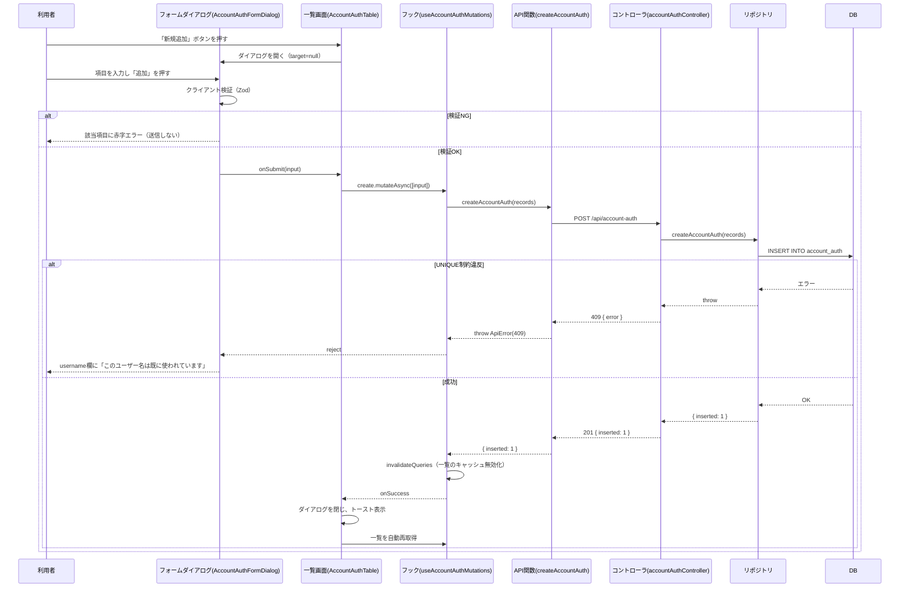
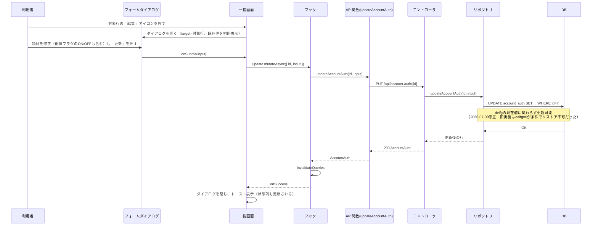
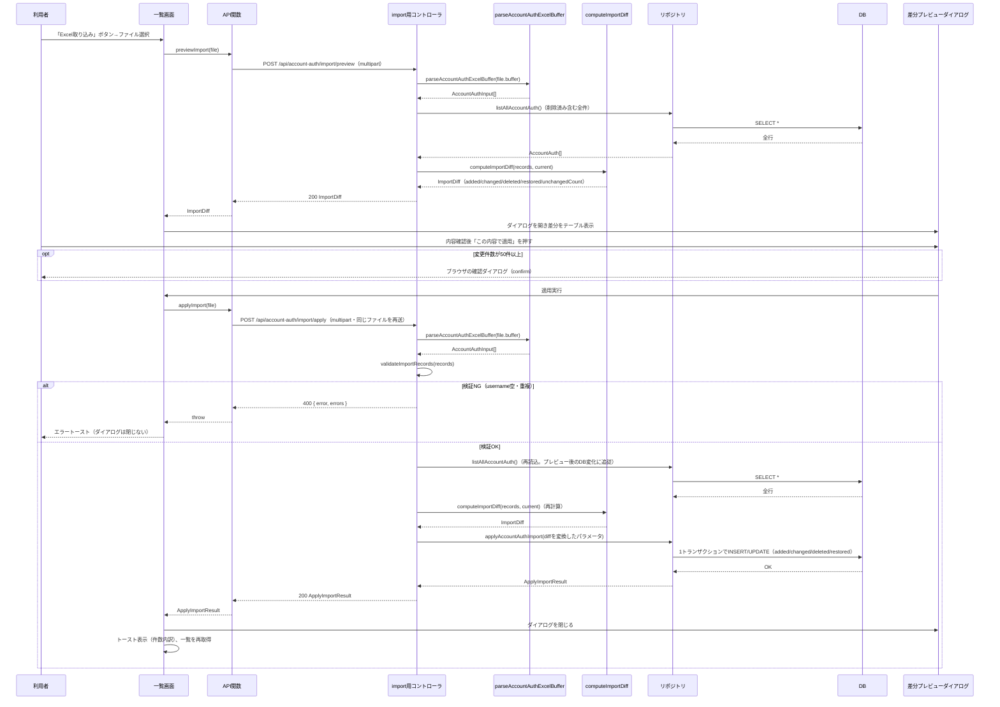

# シーケンス図 — アカウント認証機能

（作成: 2026-07-13。`AccountAuthTable.tsx`・`AccountAuthFormDialog.tsx`・`useAccountAuth.ts`・`accountAuthController.ts`・`accountAuthImportController.ts`・`repositories/accountAuth.ts`の実装を基に作成。参加者名は`docs/画面実装パターン.md`の記法に合わせる）

> 以下の`DB`参加者は現状（デモ）のSQLiteを指す。本番ではリポジトリの実装が客先PHPへのAPI呼び出しに置き換わり、DBを直接操作するのは客先PHPのみになる（Expressから直接のSQL発行は無い）。

## 1. UC-A02: 新規追加

## 2. UC-A03/04/05: 編集（削除・リストアを含む）

## 3. UC-A06/07: Excel取り込み（差分プレビュー→適用）

## 補足

- 差分プレビュー〜適用の間にDBが変化していても安全なように、**適用時に差分を再計算**している（プレビュー結果をそのまま信用しない）
- パースはサーバー側で行う（`parseAccountAuthExcelBuffer`）。クライアントはファイルをそのままアップロードするだけ（2026-07-10の設計変更。理由は`docs/アカウント認証_Excel取り込み設計.md`参照）
