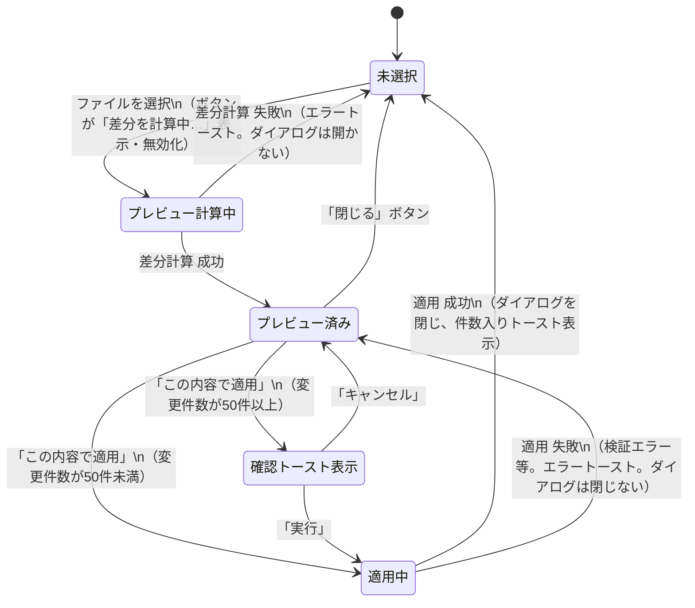

# 状態遷移図 — Excel取り込み機能

（作成: 2026-07-13。2026-07-14、①RTK Query移行に伴う状態名の変更、②プレビュー計算中のローディング表示追加、③`confirm()`を確認トーストに置き換え、を反映。`client/src/pages/AccountAuthTable.tsx`の`diff`/`diffOpen`/`pendingFile`/`previewLoading`/`confirmState`/`applying`（`useApplyAccountAuthImportDiffMutation()`の`isLoading`）の状態管理を基に作成）

## 対象

UC-A06（Excelを取り込み一括反映する）・UC-A07（差分プレビューを確認する）の一連の状態遷移。他のユースケース（新規追加・編集）はモーダルの開閉のみで状態遷移と呼べるほどの複雑さが無いため対象外。

## 状態遷移図

## 状態の説明

| 状態 | 画面上の見え方 | 対応する実装 |
|---|---|---|
| 未選択 | 一覧画面のみ表示（ダイアログ非表示） | `diffOpen=false`, `diff=null`, `pendingFile=null` |
| プレビュー計算中 | 「Excel取り込み」ボタンが「差分を計算中…」表示・無効化（スピナー付き） | `previewLoading=true`（`previewImport(file)`のPromiseが未解決の間） |
| プレビュー済み | 差分プレビューダイアログ表示中 | `diffOpen=true`, `diff`に差分結果 |
| 確認トースト表示 | 画面下部にトースト（警告色）で確認メッセージ＋「キャンセル/実行」ボタン。自動では閉じない | `confirmState`に`{message, onConfirm}`をセット |
| 適用中 | 「この内容で適用」ボタンが「適用中…」表示・無効化 | `applying=true`（`accountAuthApi.useApplyAccountAuthImportDiffMutation()`の`isLoading`） |

## この図で見つかった仕様上の注意点（解決済み）

- ~~「プレビュー計算中」に専用のローディング表示が無い~~ → **2026-07-14解決**。`previewLoading`を追加し、ボタンにMUIの`loading`プロパティ（スピナー＋自動disabled）を付けた
- ~~「確認ダイアログ表示」はブラウザの同期的な`confirm()`関数呼び出しであるため、他の状態とは性質が異なる（画面が完全にブロックされる）~~ → **2026-07-14解決**。`confirm()`をやめ、他のトースト（追加/更新/エラー通知）と同じSnackbar/Alertベースの確認トーストに統一した。Reactの状態（`confirmState`）で管理されるため、他の状態と同じ性質になった
