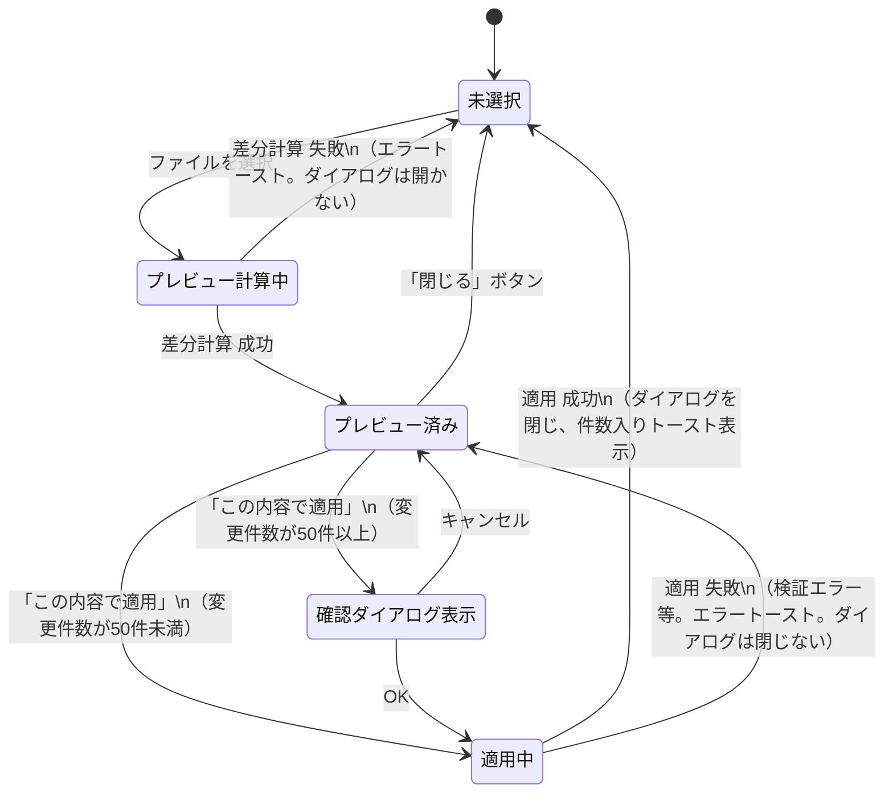

# 状態遷移図 — Excel取り込み機能

（作成: 2026-07-13。`client/src/pages/AccountAuthTable.tsx`の`diff`/`diffOpen`/`pendingFile`/`applyImportDiff.isPending`の状態管理を基に作成）

## 対象

UC-A06（Excelを取り込み一括反映する）・UC-A07（差分プレビューを確認する）の一連の状態遷移。他のユースケース（新規追加・編集）はモーダルの開閉のみで状態遷移と呼べるほどの複雑さが無いため対象外。

## 状態遷移図

## 状態の説明

| 状態 | 画面上の見え方 | 対応する実装 |
|---|---|---|
| 未選択 | 一覧画面のみ表示（ダイアログ非表示） | `diffOpen=false`, `diff=null`, `pendingFile=null` |
| プレビュー計算中 | 一覧画面のまま（ローディング表示は無し） | `previewImport(file)`のPromiseが未解決の間 |
| プレビュー済み | 差分プレビューダイアログ表示中 | `diffOpen=true`, `diff`に差分結果 |
| 確認ダイアログ表示 | ブラウザ標準の`confirm()`ダイアログ | `APPLY_CONFIRM_THRESHOLD`(=50)以上の変更件数の場合のみ経由 |
| 適用中 | 「この内容で適用」ボタンが「適用中…」表示・無効化 | `applyImportDiff.isPending=true` |

## この図で見つかった仕様上の注意点

- **「プレビュー計算中」に専用のローディング表示が無い**。ファイル選択からプレビューダイアログが開くまでの間、ユーザーには何も進行状況が見えない（特に大きいファイルの場合、待たされている実感が無く誤って複数回ボタンを押す恐れがある）。改善候補として記録
- 「確認ダイアログ表示」はReactの状態ではなくブラウザの同期的な`confirm()`関数呼び出しであるため、他の状態とは性質が異なる（画面が完全にブロックされる）
