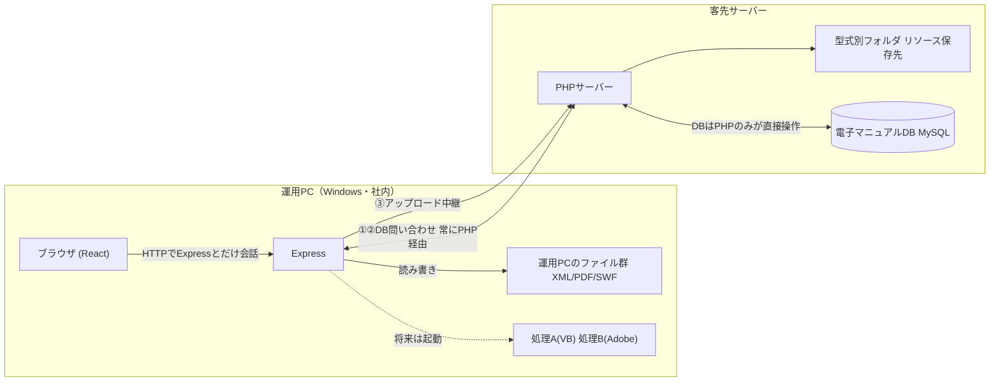
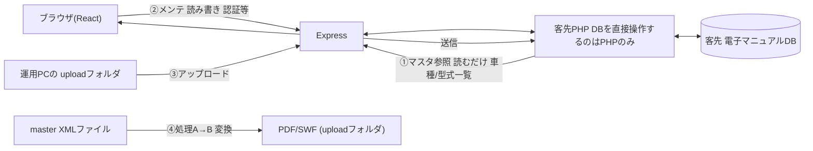
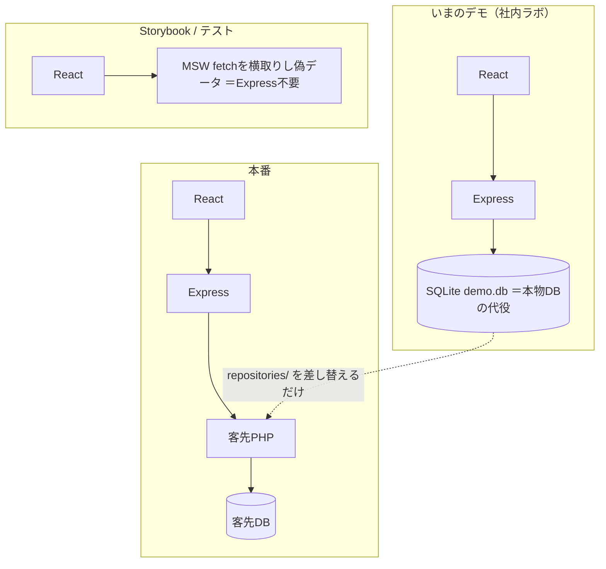
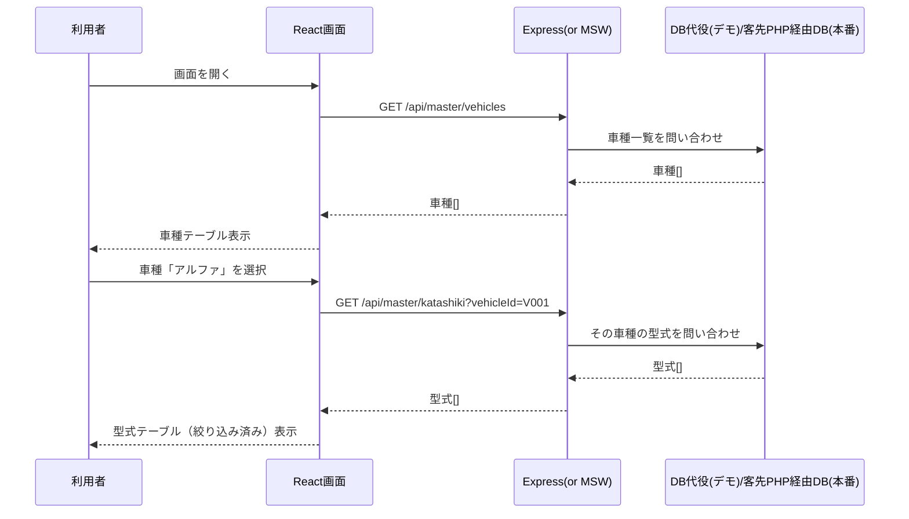

# システム全体図（データのやり取り）

「どのデータが、どこから来て、どこへ行くか」を人に説明するための、初見向けの噛み砕いた地図。
**正式なシステム構成図は[design/06_システム構成図](design/06_システム構成図.md)**。本書と矛盾する場合は06を正とする。
図は **Mermaid**。VS Code では Markdown プレビュー（Cmd+Shift+V）で図として表示される。
表示されない場合は末尾「図が表示されないとき」を参照。
コードの通り道は `データフロー.md`、配置（ハード）は `デプロイ構成.md` 参照。
（最終更新: 2026-07-14。design/06との整合を確認）

---

## 1. 全体像：登場人物と接続

**鉄則3つ**
1. ブラウザは **Express としか会話しない**
2. Express が **ファイル操作・DB問い合わせ（PHP経由）・アップロード中継** を肩代わり
3. 客先には **ファイル置き場(PHP)** と **DB** がある。**DBを直接操作できるのはPHPだけ**（ExpressはDBに直接接続しない）

---

## 2. データは4種類、流れが違う

| # | 種別 | 向き | ひとことで |
|---|------|------|-----------|
| ① | マスタ参照（車種/型式） | 読むだけ | 画面で「何を扱うか」を選ぶための一覧（PHP経由でDBを参照） |
| ② | メンテナンス（認証等） | 読み書き | 客先PHP経由で客先DBのテーブルをGUI/Excelで書き換え。**ExpressはDBに直接接続しない** |
| ③ | アップロード | 送る | 運用PCのファイルを客先へ。型式別DBでフィルタ |
| ④ | 処理A/B | 変換 | XML→分割→PDF/SWF。今は手動、将来Express起動 |

> いま作っている **車種/型式の選択テーブルは ①マスタ参照**。

---

## 3. ④処理パイプライン（アップロード前の準備）

XMLを分割し（A）、画像系に変換する（B）。Windows必須。現状は手動運用。

---

## 4. いま（デモ）vs 本番：モックの正体

| 文脈 | データの出どころ |
|------|-----------------|
| 実開発（`yarn dev`） | Express + **SQLite(demo.db)** ＝客先DBの代役 |
| Storybook / テスト | **MSW**（偽API・メモリ上）＝Express不要 |
| 本番 | 客先PHP経由の客先DB（**ExpressはDBに直接接続しない**） |

**差し替え点は1箇所**：`server/src/repositories/*.ts`。
今はSQLiteを読む → 本番は客先PHP呼び出しへ。DBを直接操作するのはPHPのみ。画面・フック・API関数・ルートは**無変更**。

---

## 5. 具体例：車種を選ぶと型式が絞り込まれる（時系列）

> 本番ではDへの矢印は**客先PHPへのHTTPリクエスト**になる。ExpressがDBへ直接SQLを発行することは無い。

---

## 客先の3つのDB（役割の違い）

| DB | 場所 | 役割 | このツールとの関係 |
|----|------|------|-------------------|
| **電子マニュアルDB**(MySQL) | 客先サーバー | マニュアル表示の各種テーブル | **メンテ対象の本体**（②の書き換え先。**客先PHP経由**でのみアクセス、Expressから直接接続はしない） |
| **共通DB**(SQLite) | エンドユーザー端末 | 全型式共通のメニュー/カタログ | 処理A/Bが生成。**今回スコープ外** |
| **型式別DB**(SQLite) | 配布物/運用PC | 型式ごとのリソース定義マップ | ③アップロードのフィルタに使う |

> 単に「DB」と言うときは **電子マニュアルDB(MySQL)** を指す。

---

## 一言まとめ（説明用）

> ブラウザはExpressとだけ話す。Expressが **①客先PHP経由でDBを読み（車種/型式）②客先PHP経由でDBを読み書きし（メンテ）③ファイルを客先PHPへ送り（アップロード）④将来は変換処理も起動する**。**DBを直接操作することは無く、常に客先PHPを介する**。
> 今は客先に繋げないので、DBはSQLiteの代役、Storybook/テストはMSWの偽APIで動かしている。本番化はExpressの `repositories/` を客先PHP呼び出しに差し替えるだけ。

---

## 図が表示されないとき

VS Code でこのファイルの図が出ない場合、順に確認する。

1. **拡張機能** `bierner.markdown-mermaid`（Markdown Preview Mermaid Support）が入っているか
   → 入っていることは確認済み。
2. **ウィンドウを再読み込み**する（最重要）
   コマンドパレット（Cmd+Shift+P）→ `Developer: Reload Window`
   ※拡張はインストール後リロードするまでプレビューに反映されない。
3. **プレビューを開き直す**：このファイルで Cmd+Shift+V
4. それでも出なければ、プレビュー右上の更新、または一度ファイルを閉じて開き直す。

> Mermaid は折りたたみ（`
`）や非表示要素の中だと描画に失敗するため、本ファイルでは図を常に表示している。
