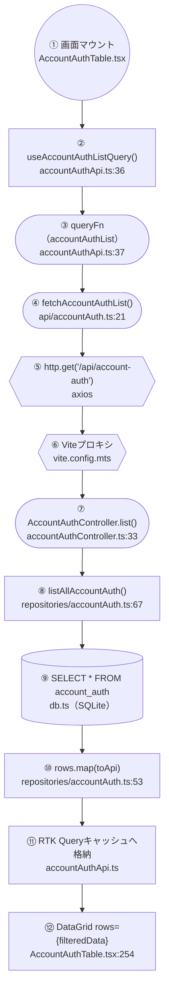

# データフロー（APIはどこを通り、どこがモックか）

「APIをどこで叩いて、どこを通って、どこがモックなのか分からなくなる」を解消するための地図。
account-auth 機能を実例に、実在ファイル名つきで示す。
（最終更新: 2026-07-21。includeDeleted廃止を反映、一覧取得の関数レベル・同期非同期つきフローチャートを追加）

---

## 大原則：出口は1つ

画面は **直接 axios を呼ばない**。必ず RTK Query（`store/services/xxxApi.ts`） → API関数 を経由する。
だから「APIをどこで叩くか」は常に1ファイル（`api/xxx.ts`）に集約される。

```
[画面]      pages/AccountAuthTable.tsx          ボタンを押す/一覧を表示
   ↓ 呼ぶ（accountAuthApiの生成フックを直接import）
[RTK Query] store/services/accountAuthApi.ts    取得・キャッシュ・再取得・invalidate
   ↓ 呼ぶ
[API関数]   api/accountAuth.ts                  ← axios(http.get等)を呼ぶのは ここだけ
   ↓ HTTPリクエスト
  （この先が、動かす場所によって3つに分岐する）
```

> 画面と`store/services/xxxApi.ts`の間に「フック(`hooks/useXxx.ts`)」を挟むのは、`skip`条件などの実ロジックがある時だけ（account-authには無いので無し。詳細は`画面実装パターン.md`§3）。

---

## 同じリクエストが「3つの世界」に分岐する

`http.get('/api/account-auth')（axios）` のURLは常に同じ。**動かす文脈によって行き先だけ変わる。**

### ① 本番・実開発（`yarn dev`）

```
api/accountAuth.ts
   │ http.get('/api/account-auth')（axios）
   ▼
Viteプロキシ（vite.config.mts: /api → localhost:3001 へ転送）
   ▼
Express  server/src/index.ts → RegisterRoutes(tsoa生成) → controllers/accountAuthController.ts
   ▼
リポジトリ  server/src/repositories/accountAuth.ts   ←★将来ここをPHP呼び出しに差し替える
   ▼
DB  server/src/db.ts → SQLite（server/data/demo.db）
```

### ② Storybook（`yarn storybook`）

```
api/accountAuth.ts
   │ http.get('/api/account-auth')（axios）
   ▼
MSW が横取り  src/mocks/accountAuthHandlers.ts     ←★Expressは動いていない
   ▼
メモリ上の偽データを返す（追加・編集・削除もメモリ上で反映）
```

### ③ テスト（`vitest`）

```
api/accountAuth.ts
   │ http.get('/api/account-auth')（axios）
   ▼
MSW が横取り  src/mocks/accountAuthHandlers.ts（②と同じものを再利用）
   ▼
メモリ上の偽データを返す
```

---

## 一枚図

```
                    画面 pages/AccountAuthTable.tsx
                              │
                    RTK Query store/services/accountAuthApi.ts
                              │
              API関数 api/accountAuth.ts   ← axiosを呼ぶのはここだけ
                              │
          ┌───────────────────┼───────────────────┐
          │                   │                   │
     ① yarn dev          ② storybook         ③ vitest
          │                   │                   │
   Viteプロキシ            MSW横取り            MSW横取り
   (vite.config.mts)   (accountAuthHandlers) (同じhandlers)
          │                   │                   │
   Express :3001          偽データ              偽データ
   controller(tsoa)     （メモリ上）          （メモリ上）
          │
   repositories/accountAuth.ts  ←★本番化で差し替える唯一の場所
          │
   SQLite  server/data/demo.db
```

---

## 具体トレース：1回のAPI呼び出しを関数名つきで最後まで追う

新人が「実際どの関数がどの順で呼ばれるの？」を追えるように、実行順で示す。

### A. 一覧取得（GET・成功・本番/実開発）

> 2026-07-21、`includeDeleted`クエリパラメータを廃止（常に全件＝削除済み含むを返す方式に統一）した変更を反映。

```
1. 画面        AccountAuthTable.tsx      accountAuthApi.useAccountAuthListQuery() を呼ぶ
2. RTK Query   store/services/accountAuthApi.ts  queryFn が fetchAccountAuthList を実行
3. API関数     api/accountAuth.ts        fetchAccountAuthList() → http.get('/api/account-auth')（axios）
4. プロキシ    vite.config.mts           /api を http://localhost:3001 へ転送
5. 振り分け    index.ts                  RegisterRoutes(app)（tsoa生成）がURLをコントローラへ
6. コントローラ accountAuthController.ts list() が listAllAccountAuth() を呼ぶ
7. リポジトリ   repositories/accountAuth.ts listAllAccountAuth()：SELECT * FROM account_auth（全件）、tinyint→boolean変換
8. DB          db.ts                     SQLite が行を返す
9. 復路        6→3 へ JSON で戻り、queryFnのdataに入る
10. 描画       AccountAuthTable.tsx      data をテーブル表示
```

関数レベル・同期/非同期の区別込みの図は次節を参照。

### A'. 一覧取得の処理フロー図（関数レベル・同期/非同期の区別つき）

**狙い**: 「画面でイベントが起きた時、どの関数が・どのファイルを・どの順で踏んでいくか」を示す。
今後どの画面・どのテーブルを新しく作る時も、この並びをそのままなぞればよい（詳しくは[画面実装パターン](画面実装パターン.md)）。

図形の意味：`([...])` スタジアム型＝**非同期**（結果が返るまで待つ）／ `[...]` 四角＝**同期**（即座に返る）／ `{{...}}` 六角形＝ネットワーク境界／ `[(...)]` 円柱＝データベース／ `((...))` 円＝起点



**各ステップで実際に何が起きているか**

| #   | 関数・ファイル                                                  | 具体的にしていること                                                                                                                                                                                                         |
| --- | --------------------------------------------------------------- | ---------------------------------------------------------------------------------------------------------------------------------------------------------------------------------------------------------------------------- |
| ①   | `AccountAuthTable.tsx`                                          | 「アカウント認証」画面がブラウザに表示される。この瞬間、Reactが②のフックを実行する                                                                                                                                           |
| ②   | `useAccountAuthListQuery()`（`accountAuthApi.ts:36`）           | RTK Queryが提供するフック。呼ばれた瞬間に「一覧を取得するリクエスト」を裏側で自動発火する。画面のコードは`fetch`を一切書かない                                                                                               |
| ③   | `queryFn`（`accountAuthApi.ts:37`）                             | ②が発火したリクエストの実処理本体。中で`await`しているので、ここから先は結果が返るまで処理が止まる（非同期）                                                                                                                 |
| ④   | `fetchAccountAuthList()`（`api/accountAuth.ts:21`）             | axiosでHTTPリクエストを組み立てる関数。このプロジェクトでは通信コードをこの1ファイルに集約するルールになっている                                                                                                             |
| ⑤   | `http.get('/api/account-auth')`（axios）                        | ブラウザから実際にネットワーク越しにGETリクエストを送信する。ここが「サーバーに問い合わせる」瞬間                                                                                                                            |
| ⑥   | Viteプロキシ（`vite.config.mts`）                               | 開発環境限定の転送設定。ブラウザ(3000番)から来た`/api`宛のリクエストを中継サーバー(3001番)へ転送する。ポート番号が違うとブラウザのセキュリティ制限（CORS）に引っかかるため、それを避ける目的。**本番ではこのステップごと無くなる**：デプロイ時に`vite build`でReactを静的ファイルに固め、それをExpress自身が配信するため、画面もAPIも同じオリジンになりプロキシが不要になる（[デプロイ構成](デプロイ構成.md)参照） |
| ⑦   | `AccountAuthController.list()`（`accountAuthController.ts:33`） | 中継サーバー（Express）側で、このURL・このHTTPメソッド(GET)を受け持つ関数。リクエストを受け取り、実際のデータ取得は⑧に任せる                                                                                                 |
| ⑧   | `listAllAccountAuth()`（`repositories/accountAuth.ts:67`）      | データベースへの問い合わせ本体。SQLの`SELECT`文を組み立てて実行する。**ここは同期処理**（`better-sqlite3`というライブラリの特性上、結果が即座に返る）                                                                        |
| ⑨   | SQLite（`account_auth`テーブル）                                | 実データが保存されている場所。削除済み行も含めた全レコードをここで読み出す                                                                                                                                                   |
| ⑩   | `rows.map(toApi)`（`repositories/accountAuth.ts:53`）           | データベース特有の書き方（削除フラグなどが0/1の数値）を、画面が扱いやすい形（true/false）に変換する                                                                                                                          |
| ⑪   | RTK Queryキャッシュ更新（`accountAuthApi.ts`）                  | ⑦〜④を逆順に辿って結果がブラウザに届いた後、その結果をキャッシュに保存する。次に同じ画面を開いた時はここから即座に返せる                                                                                                     |
| ⑫   | `DataGrid rows={filteredData}`（`AccountAuthTable.tsx:254`）    | キャッシュの更新をReactが検知して再描画。検索条件で絞り込んだ後のデータが、実際に表（グリッド）として画面に描画される                                                                                                        |

**この構成が「型」である理由**：新しいテーブル・画面を追加する時も、必ずこの並び（画面 → RTK Query → API関数 → コントローラ → リポジトリ → DB）でファイルを作ることになる。途中を省略したり順番を入れ替えたりしない、というのがこのプロジェクトの決まりごと。

### B. 追加でユーザー名重複（POST・エラー・項目下に赤字が出るまで）

```
1. フォーム送信 AccountAuthFormDialog.tsx  Zod検証OK → onSubmit(input)
2. 画面        AccountAuthTable.tsx       handleSubmit → create([input]).unwrap()
3. RTK Query   store/services/accountAuthApi.ts  queryFnがcreateAccountAuth(records)を実行
4. API関数     api/accountAuth.ts         createAccountAuth() → POST /api/account-auth
5. コントローラ accountAuthController.ts   create() → repository createAccountAuth()
6. リポジトリ   repositories/accountAuth.ts INSERT → username重複でSQLiteがUNIQUE例外
7. コントローラ accountAuthController.ts   例外をcatch → 409 {error} を返す
8. API関数     api/accountAuth.ts         axiosが非2xxで例外 → catch(err) → toApiError(err) で ApiError に変換して throw
9. RTK Query   store/services/accountAuthApi.ts  queryFnが{error: ApiError}を返す → unwrap()がreject
10. 復路        ダイアログの try/catch が捕捉
11. 変換        api/error.ts               toFieldErrors(err)：409 → { username: 'このユーザー名は既に使われています' }
12. 表示       AccountAuthFormDialog.tsx  setError('username', …) → username項目の下に赤字
```

> 紐付かないエラー（通信断・500）はダイアログ上部Alert、一覧操作（削除/Excel）の全体エラーはトースト。詳細は `バリデーションとエラー処理.md`。

### ②Storybook / ③テストの場合

上記 4〜8（プロキシ→Express→DB）が丸ごと **MSW** に置き換わる。axiosが呼ぶURLは同じまま `mocks/accountAuthHandlers.ts` が横取りして偽データを返す（1〜3, 9〜10は同じ）。

---

## MSW（モック）の仕組み

- MSW = Mock Service Worker。**ネットワーク層でリクエスト（axios/fetchいずれも）を横取り**して偽の応答を返す。
- アプリ側のコード（リクエスト先のURL）は**一切変えない**。だから「本番もStorybookも同じコードが動く」。
- ハンドラー定義: `src/mocks/handlers.ts`（共通） + `src/mocks/accountAuthHandlers.ts`（account-auth用）
- 文脈ごとの起動:
  - Storybook → `.storybook/preview.tsx`（ブラウザ用 service worker）
  - Vitest → `src/mocks/server.ts` + `vitest-setup.ts`（Node用）
  - account-auth ハンドラーは**メモリ上に状態を持ち**、CRUDが実際に反映される（`resetAccountAuthMock()` で初期化）

---

## ファイル早見表（account-auth）

| 役割               | ファイル                                                      | 一言                                                                       |
| ------------------ | ------------------------------------------------------------- | -------------------------------------------------------------------------- |
| 画面               | `client/src/pages/AccountAuthTable.tsx`                       | 表・ボタン・ダイアログ                                                     |
| フォーム           | `client/src/components/accountAuth/AccountAuthFormDialog.tsx` | 追加/編集ダイアログ                                                        |
| Excel解析          | `client/src/components/accountAuth/parseExcel.ts`             | xlsx→レコード（純粋関数）                                                  |
| RTK Query          | `client/src/store/services/accountAuthApi.ts`                 | 取得・キャッシュ・再取得・invalidate。画面から直接import（フック層は無し） |
| **API関数**        | `client/src/api/accountAuth.ts`                               | **axios(http)の唯一の出口**                                                |
| モック             | `client/src/mocks/accountAuthHandlers.ts`                     | Storybook/テスト用の偽API                                                  |
| コントローラ(tsoa) | `server/src/controllers/accountAuthController.ts`             | エンドポイント。型からルート/検証/仕様を生成                               |
| **リポジトリ**     | `server/src/repositories/accountAuth.ts`                      | **本番化の差し替え点（SQLite→PHP）**                                       |
| DB                 | `server/src/db.ts`                                            | SQLite 接続・スキーマ・seed                                                |

---

## 覚えるべき3つの勘所

1. **出口は1つ** — どの画面も `api/xxx.ts` を通る。「APIどこ？」はここを見れば必ず分かる。
2. **MSWは“横取り役”** — リクエストのURLは同じまま。MSWがExpressの代わりに返事するので、Express無しでStorybook/テストが動く。
3. **差し替え点は1箇所** — 本番化で変えるのは `repositories/xxx.ts`（SQLite→PHP）だけ。画面・RTK Query・API関数は無変更。

> 新しいメンテナンステーブルを足すときも、この同じ8ファイル構成（画面/ダイアログ/RTK Queryスライス/API関数/モック/ルート/リポジトリ/DB。フックは実ロジックがある時だけ追加）をなぞればよい。
