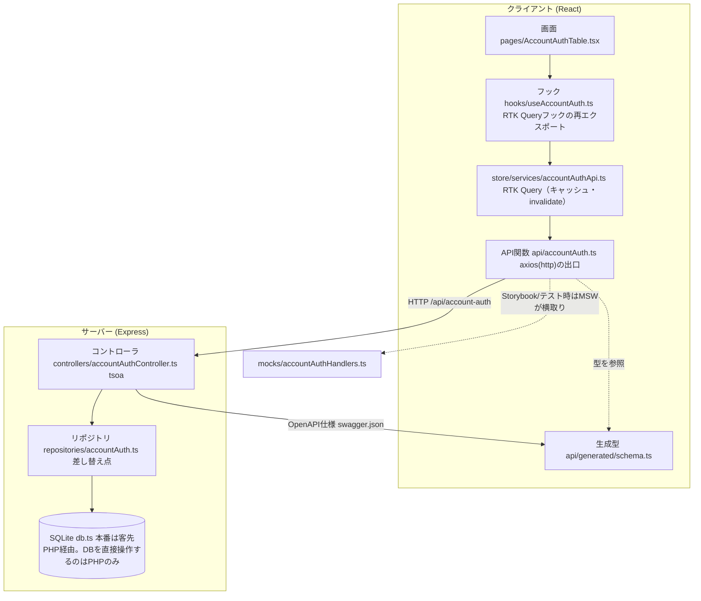
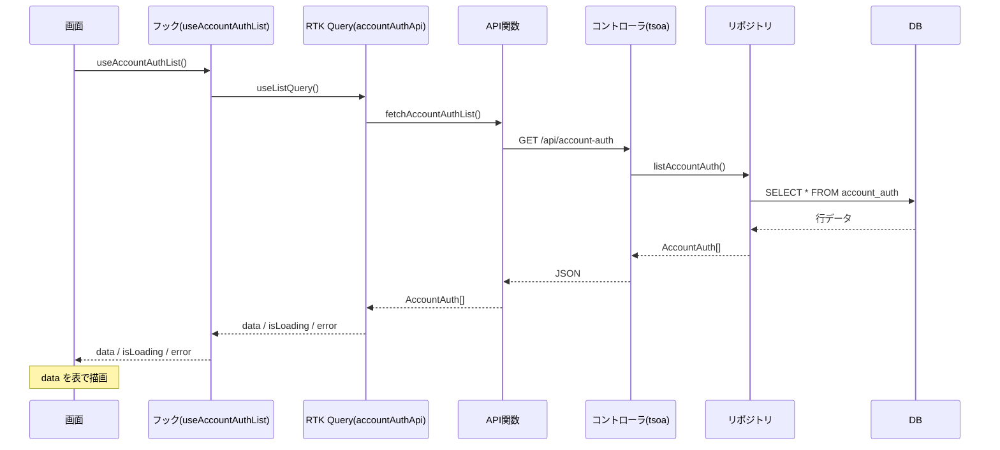

# 画面実装パターン（accountAuthを基本形として）

「アカウント認証テーブル」のようなDB系の画面を作るときの**考え方**と**情報の通り道**。
新しいメンテナンス画面はこの型をなぞればよい。各ファイル冒頭にも同じ説明をコメントで置いてある。
**レイヤ構成・本番化の差し替え点・例外処理方式の正式な定義は[design/07_アプリケーション方式設計書](design/07_アプリケーション方式設計書.md)**（本書はそれを踏まえた実装者向けチェックリスト・具体例に絞る。矛盾する場合は07を正とする）。
（最終更新: 2026-07-14。サーバーAPIは tsoa + OpenAPI 構成）

---

## 0. 一番大事な考え方：レイヤ分け（関心の分離）

1つの機能を「役割ごとの層」に分け、**各層は隣の層としか話さない**。
こうすると、変更・テスト・モックが1箇所で済む。層ごとの役割・知らないことの一覧表は[design/07 §1](design/07_アプリケーション方式設計書.md#1-レイヤ構成)を参照（本書では省略、重複を避ける）。

> ポイント: **画面はaxiosを呼ばない。axiosを呼ぶのはAPI関数だけ。DBアクセスはリポジトリだけ。**
> さらに **型はサーバーのtsoaコントローラが単一の真実**（OpenAPI仕様→クライアント型を自動生成）。

---

## 1. 全体のレイヤ図



> `yarn gen:api` で「コントローラ → OpenAPI仕様 → クライアント型(schema.ts)」を再生成。
> Swagger UI は `http://localhost:3001/api-docs`。

---

## 2. リクエスト1回の流れ（一覧取得の例）



書き込み（追加/更新/削除）も同じ道。違いは、フックが「mutationトリガー関数」を使い（`create(records)`のように直接呼ぶ。TanStack Queryのような`.mutate()`オブジェクトではない）、
成功後に`invalidatesTags`で一覧を自動再取得する点だけ（`store/services/accountAuthApi.ts`で宣言）。
不正なリクエストは**コントローラの型に基づき tsoa が自動で422を返す**（手書き検証は不要）。

---

## 3. ファイル構成（この9個で1機能）

| # | レイヤ | ファイル | 新機能で必ず変える |
|---|--------|----------|:---:|
| 1 | 画面 | `client/src/pages/Xxx.tsx` | ✅ |
| 2 | フォーム | `client/src/components/xxx/XxxFormDialog.tsx` | ✅ |
| 3 | フック | `client/src/hooks/useXxx.ts`（RTK Queryフックの再エクスポート） | ✅ |
| 4 | RTK Query APIスライス | `client/src/store/services/xxxApi.ts`（キャッシュ・invalidate） | ✅ |
| 5 | API関数 | `client/src/api/xxx.ts`（型は生成schemaを参照） | ✅ |
| 6 | モック | `client/src/mocks/xxxHandlers.ts` | ✅ |
| 7 | コントローラ(tsoa) | `server/src/controllers/xxxController.ts` | ✅ |
| 8 | リポジトリ | `server/src/repositories/xxx.ts` | ✅ |
| 9 | DB | `server/src/db.ts`（テーブル追加） | ✅ |

加えて必要な「登録・生成」：
- `client/src/App.tsx` … 画面のルートを追加
- `client/src/mocks/handlers.ts` … `...xxxHandlers` を追加
- **`yarn gen:api`** … コントローラ→OpenAPI仕様→クライアント型を再生成
  （`RegisterRoutes(app)` が全コントローラを一括登録するので、index.ts への手動 `app.use` は不要）

---

## 4. 新しい画面を作る手順（チェックリスト）

accountAuth をコピーして名前を変えるのが最短。**下から上**（DB→公開）に作ると繋ぎながら確認できる。

```
[ ] 1. db.ts にテーブル定義 + seed を追加
[ ] 2. repositories/xxx.ts … list/create/update/delete（SQLite読み書き）
[ ] 3. controllers/xxxController.ts … tsoaデコレータ(@Route/@Get/@Post…)で型を書く
       入力検証は型から自動。手書きの400/422チェックは不要
[ ] 4. yarn gen:api（or npm run tsoa）で生成 → Swagger UI(/api-docs) と curl で疎通確認
[ ] 5. api/xxx.ts … 型は generated/schema を参照、axios(http)を呼ぶ関数を書く
[ ] 6. store/services/xxxApi.ts … createApi + fakeBaseQuery。queryFnでapi/xxx.tsの関数を呼ぶだけ
       （新規query/mutationごとに store/index.ts の reducer/middleware に追加登録）
[ ] 7. hooks/useXxx.ts … xxxApi の生成フックに機能名を付けて再エクスポート
[ ] 8. components/xxx/XxxFormDialog.tsx … RHF + Zod のフォーム
[ ] 9. pages/Xxx.tsx … 表 + ボタン + ダイアログ（mutationは `trigger(引数).unwrap()` で呼ぶ）
[ ] 10. App.tsx に画面ルートを登録
[ ] 11. mocks/xxxHandlers.ts + handlers.ts に登録（Storybook/テスト用）
[ ] 12. *.stories.tsx を書く（実装と必ずセット。decoratorはReduxProvider+`createStore()`）
[ ] 13. 検証: tsc / vitest / 実機（一覧・追加・編集・削除）
```

---

## 5. なぜこの形なのか（効いてくる場面）

- **本番化**：客先PHPを呼ぶように切り替えるとき、変えるのは `repositories/xxx.ts` だけ。DBを直接操作するのは客先PHPのみで、Expressから直接接続することは無い。
  画面・フック・API関数・コントローラは無変更（→ `データフロー.md`）。
- **型の単一の真実**：サーバーのコントローラ型 → OpenAPI仕様 → クライアント型を生成。
  client/server で型を二重に書かない（食い違いがコンパイル時に出る）。
- **入力検証が自動**：コントローラの型に合わないリクエストは tsoa が422で弾く。
- **テスト/Storybook**：Expressを起動せず `mocks/xxxHandlers.ts` で動く。
  リクエストのURLは本番と同じなので、モック用の分岐がコードに混ざらない。
- **横展開**：9ファイルの型が決まっているので、2機能目以降はコピペ＋改名で速い。

> まず読むべき実物: `accountAuth` 一式（各ファイル冒頭のコメントが、その層の役割を説明している）。
> ※ 現状 tsoa化済みは account-auth のみ。master(車種/型式)等の手書きルートは順次コントローラへ移行。

---

## 6. 大量データの一覧は MUI X DataGrid を使う

手組みの`<Table>`は、数十〜数百行なら問題ないが、**数千〜数万行になると仮想化なしのDOM展開でブラウザが固まる**（アカウント認証のExcel差分プレビューで実測: 20000行で約13.7秒ブロック。DataGrid化後は約0.3秒に短縮。詳細は`docs/アカウント認証_Excel取り込み設計.md`）。

- **Community版（無料・MIT）で仮想化は標準搭載**。Pro/Premiumの契約は不要
- 実装例: `client/src/pages/AccountAuthTable.tsx`・`client/src/components/accountAuth/ImportDiffDialog.tsx`（`GridColDef`・`renderCell`でChip等のカスタム描画、`GridActionsCellItem`で操作列）
- 想定件数が少ない（目安: 数十件程度で今後も増えない）画面は、従来通り手組み`<Table>`で構わない。**将来数百件以上になりうる一覧（型式選択・約700件等）は最初からDataGridを使う**
- **検索・絞り込みはクライアント側の配列フィルタで良い**（サーバーに問い合わせない）。取得済みデータへの`Array.filter()`＋DataGridの仮想化の組み合わせで、数万件規模でも体感即座に絞り込める。仕組みの詳細は`docs/design/account-auth/10_詳細設計.md`の「検索・絞り込みが速い仕組み」参照
- **注意（ページネーションの罠）**: Community版はページネーションを完全に無効化できない（デフォルト100件/ページ）。検索・絞り込み結果を**常に全件その場で見せたい**画面では、`pageSizeOptions`に`{ value: -1, label: 'すべて' }`を追加し`initialState`のページサイズを`-1`にすること（公式サポートの機能。仮想化はページサイズと独立して効くため性能は落ちない）。忘れると「絞り込んだのに何件か見えない」という気づきにくい不具合になる
