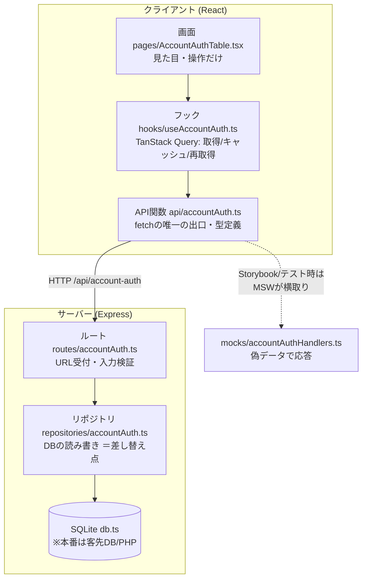
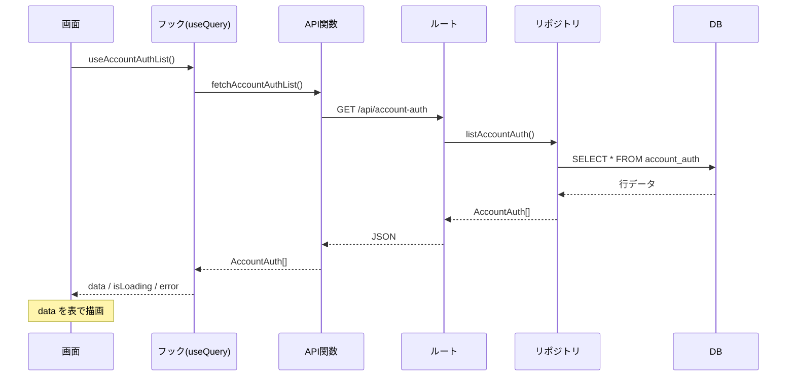

# 画面実装パターン（accountAuthを基本形として）

「アカウント認証テーブル」のようなDB系の画面を作るときの**考え方**と**情報の通り道**。
新しいメンテナンス画面はこの型をなぞればよい。各ファイル冒頭にも同じ説明をコメントで置いてある。
（最終更新: 2026-06-29）

---

## 0. 一番大事な考え方：レイヤ分け（関心の分離）

1つの機能を「役割ごとの層」に分け、**各層は隣の層としか話さない**。
こうすると、変更・テスト・モックが1箇所で済む。

| 層 | 何をする | 何を知らない |
|----|---------|-------------|
| 画面 (page) | 見た目・操作 | fetch・URL・DB |
| フック (hook) | 取得/キャッシュ/再取得 | 画面の見た目・DB |
| API関数 (api) | fetchを呼ぶ・URL・型定義 | 画面・DBの中身 |
| ── HTTPの壁 ── | | |
| ルート (route) | URL受付・入力検証 | DBの読み方 |
| リポジトリ (repository) | DBの読み書き | HTTP・画面 |
| DB | データ保管 | 上の全部 |

> ポイント: **画面は fetch を書かない。fetch は API関数だけ。DBアクセスはリポジトリだけ。**
> これが守られていれば、「本番DBへ差し替え」も「テスト用モック」も1箇所いじるだけで済む。

---

## 1. 全体のレイヤ図



---

## 2. リクエスト1回の流れ（一覧取得の例）



書き込み（追加/更新/削除）も同じ道。違いは、フックが `useMutation` を使い、
成功後に `invalidateQueries` で一覧を自動再取得する点だけ。

---

## 3. ファイル構成（この8個で1機能）

| # | レイヤ | ファイル | 新機能で必ず変える |
|---|--------|----------|:---:|
| 1 | 画面 | `client/src/pages/Xxx.tsx` | ✅ |
| 2 | フォーム | `client/src/components/xxx/XxxFormDialog.tsx` | ✅ |
| 3 | フック | `client/src/hooks/useXxx.ts` | ✅ |
| 4 | API関数 | `client/src/api/xxx.ts` | ✅ |
| 5 | モック | `client/src/mocks/xxxHandlers.ts` | ✅ |
| 6 | ルート | `server/src/routes/xxx.ts` | ✅ |
| 7 | リポジトリ | `server/src/repositories/xxx.ts` | ✅ |
| 8 | DB | `server/src/db.ts`（テーブル追加） | ✅ |

加えて2箇所の「登録」が必要：
- `server/src/index.ts` … `app.use('/api/xxx', xxxRouter)` を追加
- `client/src/App.tsx` … 画面のルートを追加
- `client/src/mocks/handlers.ts` … `...xxxHandlers` を追加

---

## 4. 新しい画面を作る手順（チェックリスト）

accountAuth をコピーして名前を変えるのが最短。**下から上**（DB→公開）に作ると繋ぎながら確認できる。

```
[ ] 1. db.ts にテーブル定義 + seed を追加
[ ] 2. repositories/xxx.ts … list/create/update/delete（SQLite読み書き）
[ ] 3. routes/xxx.ts … GET/POST/PUT/DELETE、入力検証
[ ] 4. index.ts に app.use('/api/xxx', ...) を登録
       → curl で叩いて疎通確認
[ ] 5. api/xxx.ts … 型定義 + fetch関数
[ ] 6. hooks/useXxx.ts … useQuery + useMutation
[ ] 7. components/xxx/XxxFormDialog.tsx … RHF + Zod のフォーム
[ ] 8. pages/Xxx.tsx … 表 + ボタン + ダイアログ
[ ] 9. App.tsx に画面ルートを登録
[ ] 10. mocks/xxxHandlers.ts + handlers.ts に登録（Storybook/テスト用）
[ ] 11. *.stories.tsx を書く（実装と必ずセット）
[ ] 12. 検証: tsc / vitest / 実機（一覧・追加・編集・削除）
```

---

## 5. なぜこの形なのか（効いてくる場面）

- **本番化**：客先DBに繋ぐとき、変えるのは `repositories/xxx.ts` だけ。
  画面もフックもAPI関数もルートも無変更（→ `データフロー.md`）。
- **テスト/Storybook**：Expressを起動せず `mocks/xxxHandlers.ts` で動く。
  fetchのURLは本番と同じなので、モック用の分岐がコードに混ざらない。
- **横展開**：8ファイルの型が決まっているので、2機能目以降はコピペ＋改名で速い。

> まず読むべき実物: `accountAuth` 一式（各ファイル冒頭のコメントが、その層の役割を説明している）。
